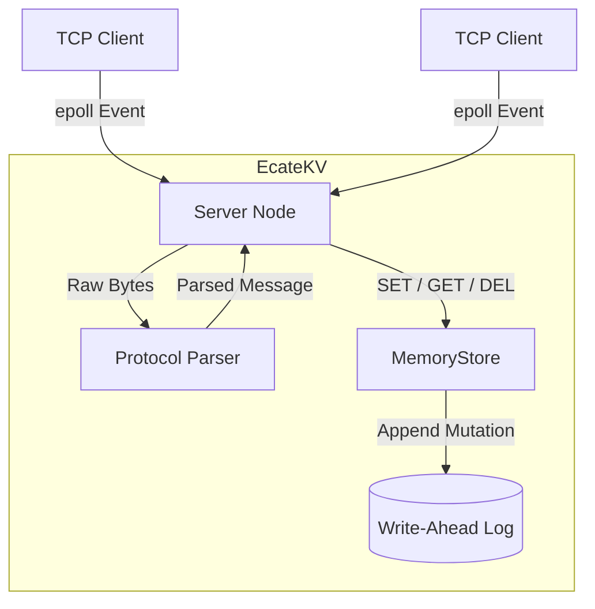

# EcateKV

**EcateKV** is a high-performance, multi-threaded, persistent, networked key-value store written in modern C++20. It is designed from scratch to serve as an educational deep-dive into advanced systems programming concepts and C++ server architecture.

## Overview
The project was built over multiple iterative phases focusing on raw performance, asynchronous behavior, and crash tolerance without relying on massive external frameworks.

- **Networking:** Utilizes a non-blocking, asynchronous event loop powered by Linux `epoll` in edge-triggered (`EPOLLET`) mode. This allows a single thread to multiplex thousands of concurrent client TCP connections with minimal overhead.
- **Custom Protocol:** Communicates via a tightly-packed, custom binary protocol (12-byte header) enforcing Big-Endian Network Byte Order for cross-platform serialization, rather than heavy text formats like HTTP or JSON.
- **Storage Engine:** Relies on an in-memory `std::unordered_map` protected by a Reader-Writer lock (`std::shared_mutex`). This permits massive parallel reads while preserving thread safety during exclusive writes.
- **Persistence:** Mutating operations (`SET`, `DEL`) are immediately serialized and appended to a Write-Ahead Log (WAL) on disk using atomic `pwrite` calls. On startup, the engine replays the log to fully recover its state, ensuring resilience against power failures and crashes.

## Architecture

The system is highly decoupled to separate networking from data persistence. 



### Flow of a Request
1. **Client Interface:** Connects via a standard TCP socket and transmits byte streams using the custom binary protocol.
2. **Server & Connection:** The non-blocking `epoll` multiplexer catches inbound events. It reads bytes from the socket into a generic dynamical `read_buffer`.
3. **Protocol Parser:** Iterates through the raw byte buffer looking for complete 12-byte headers + variable payloads, extracting clean semantic `Message` structures.
4. **Memory Store:** Dispatched by the server, it obtains a Reader or Writer (`std::shared_mutex`) lock. For reads, it extracts keys in `O(1)` time. 
5. **Write-Ahead Log (WAL):** During any mutating `SET` or `DEL`, before the lock is released or the client ACK'd, the MemoryStore natively serializes the mutation and pushes it sequentially to the disk log safely securing the data.

## Directory Structure
```
EcateKV/
├── CMakeLists.txt        # Top-level build config
├── include/ecatekv/      # Public API headers (Store, Protocol, Server, WAL)
├── src/                  # Core implementations (memory engine, epoll loop)
│   ├── main.cpp          # ecatekv_server executable entrypoint
│   └── client.cpp        # ecatekv_client benchmark tool
└── tests/                # GoogleTest suite for components
```

## Protocol Definition
Every message transported over the TCP socket consists of a 12-byte fixed header followed by optional variable-length payload buffers for the key and value.

| Field | Size | Description |
|---|---|---|
| Magic | 2 bytes | Hardcoded identifier `0xEC47` |
| Opcode | 1 byte | Command type (`GET = 1`, `SET = 2`, `DEL = 3`) |
| Status | 1 byte | Response status (`OK = 0`, `ERR = 1`) |
| Key Length | 4 bytes | Unsigned 32-bit integer detailing Key size |
| Value Length | 4 bytes | Unsigned 32-bit integer detailing Value size |

## Building & Testing

### Requirements
- A modern C++ compiler supporting C++20
- Linux environment (for `epoll` and `pwrite`)
- CMake >= 3.20

### Build Instructions
```bash
mkdir -p build && cd build
cmake ..
make -j4
```

### Running Tests
The project relies on GoogleTest (automatically downloaded via CMake FetchContent).
```bash
cd build
ctest -V
```

### Running the Server
```bash
cd build
./ecatekv_server 8080
```
This will start the server on port 8080 and auto-initialize the `ecatekv.log` WAL file in the current working directory.

### Running the Benchmark Client
To execute load tests simulating 10,000 continuous local iterations:
```bash
cd build
./ecatekv_client
```
*(You should see throughputs exceeding 10,000 ops/sec locally!)*

## License
This project is licensed under the MIT License - see the [LICENSE](LICENSE) file for details.
